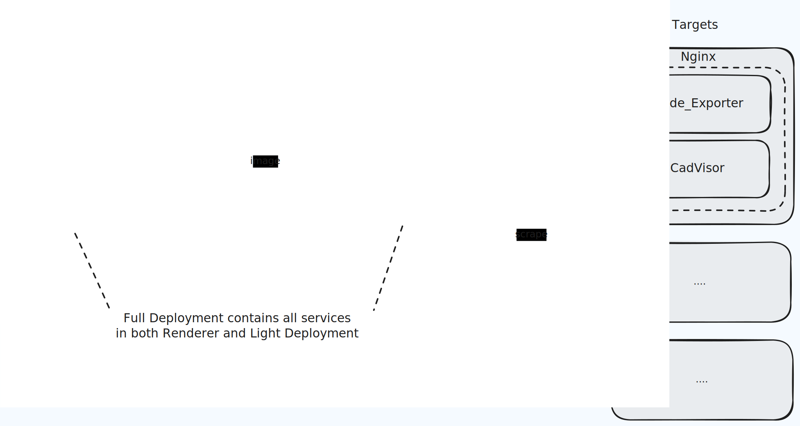

# Steps to run monitor host

This guide will help you set up a monitoring master on your Ubuntu machine using Docker.

## Architecture Diagram



The architecture diagram above illustrates the two deployment options and targets of the monitoring system, more details about target could be find in /target folder:

1. Master (Light Deployment) + Report Generator (Renderer Deployment)

    > Recommended for cost optimization - run the report generator on-demand via scripts or cloud functions.

    - **Master (Light Deployment)**
      - Core monitoring stack with Prometheus and Grafana
      - Prometheus collects metrics from various targets
      - Grafana provides visualization and dashboards
      - Suitable for basic monitoring needs
    - **Report Generator (Renderer Deployment)**
      - Specialized deployment for report generation
      - Includes grafana-image-renderer service
      - Uses headless Chrome for rendering dashboards
      - Handles image generation requests
      - Requires 16GB RAM
2. Master (Full Deployment)

    > Recommended for local testing and development environments where you need all monitoring and reporting capabilities in a single deployment.

    - **Master (Full Deployment)**
      - Combines all services from both Light and Renderer deployments
      - Requires 16GB RAM
      - Suitable for production environments with high resource availability

- **Targets**
  - Monitoring endpoints that provide metrics
  - Includes Node_Exporter for system metrics
  - CadVisor for container metrics
  - Additional custom targets can be added


## Prerequisites

### Install `Docker` and `Docker Compose`

Follow the official Docker installation steps for Ubuntu:
[docker official installation steps](https://docs.docker.com/engine/install/ubuntu)

```shell
# Add Docker's official GPG key
sudo apt-get update
sudo apt-get install ca-certificates curl
sudo install -m 0755 -d /etc/apt/keyrings
sudo curl -fsSL https://download.docker.com/linux/ubuntu/gpg -o /etc/apt/keyrings/docker.asc
sudo chmod a+r /etc/apt/keyrings/docker.asc

# Add the repository to Apt sources
echo \
  "deb [arch=$(dpkg --print-architecture) signed-by=/etc/apt/keyrings/docker.asc] https://download.docker.com/linux/ubuntu \
  $(. /etc/os-release && echo "${UBUNTU_CODENAME:-$VERSION_CODENAME}") stable" | \
  sudo tee /etc/apt/sources.list.d/docker.list > /dev/null
sudo apt-get update

# Install Docker components
sudo apt-get install docker-ce docker-ce-cli containerd.io docker-buildx-plugin docker-compose-plugin
```

## Configuration

### 1. Set Up Prometheus Configuration

```shell
# Copy and edit the Prometheus configuration template
cp config/prometheus.template.yml config/prometheus.yml
vi config/prometheus.yml
```

### 2. Choose Deployment Configuration

Select and configure the appropriate Docker Compose file based on your needs:

- **Light Deployment** (Grafana + Prometheus only):
  ```shell
  vi docker-compose-light.yml
  ```

- **Renderer Deployment** (Renderer + Chrome only):
  ```shell
  vi docker-compose-renderer.yml
  ```

- **Full Deployment** (All services - requires 16GB RAM):
  ```shell
  vi docker-compose.yml
  ```

### 3. Optional: SSL Certificate Setup

If you need SSL certificates, run this command and review your nginx configuration in docker compose file

```shell
docker run \
-v ./letsencrypt/cert:/etc/letsencrypt \
-ti certbot/certbot \
certonly \
  --email <email> \
  --agree-tos \
  --manual \
  --preferred-challenges dns \
  --server https://acme-v02.api.letsencrypt.org/directory \
  -d "*.yourdomain.com"
```

## Deployment


Choose the appropriate deployment option:

```shell
# Light deployment (Grafana + Prometheus)
docker compose -f docker-compose-light.yml up -d

# Renderer deployment (Renderer + Chrome)
docker compose -f docker-compose-renderer.yml up -d

# Full deployment (All services)
docker compose up -d
```

# Common Operations

### 1. Prometheus Management

```shell
# Reload Prometheus configuration
docker exec prometheus kill -HUP 1
```

### 2. Testing and Monitoring

```shell
# Start a test container with memory limits
docker run --rm -d --name mem_test_container -m 256m --memory-swap 256m alpine sleep 300

# Run stress test
stress --vm 1 --vm-bytes 450M --timeout 5m
```